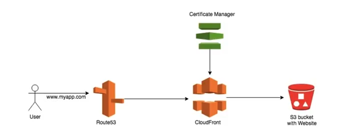

# static-web-hosting

Navigate to https://heshankarunaratne.github.io/static-web-hosting/ to view the website in Github Pages

## Steps
1. Create a S3 bucket
2. Enable static web hosting
3. Upload content to the bucket
4. Click on Bucket endpoint url
    
    - http://myawsbucket-11431431131.s3-website-us-east-1.amazonaws.com/
5. You are getting a 403 Forbidden Error since we have not given any permission
6. Disable Block public access
7. Navigate to Permission tab and click on Bucket Policy and add below policy
    ~~~json
    {
        "Version": "2012-10-17",
        "Statement": {
            "Sid": "AddPerm",
            "Principal": "*",
            "Effect": "Allow",
            "Action": "s3:GetObject",
            "Resource": "arn:aws:s3:::myawsbucket-11431431131/*"
        }
    }
    ~~~
8. When you click on bucket endpoint url it works now
9. Create a CloudFront distribution
10. Add an alternate domain
11. Request a custom SSL certificate
12. Navigate to behaviours in CloudFront and change Viewer Protocol policy to "Redirect HTTP to HTTPS"
13. Create an A record(Alias record) in Route53 and point to the CloudFront distribution
14. If all the configurations correct when you navigate to CloudFront domain it should display the website

